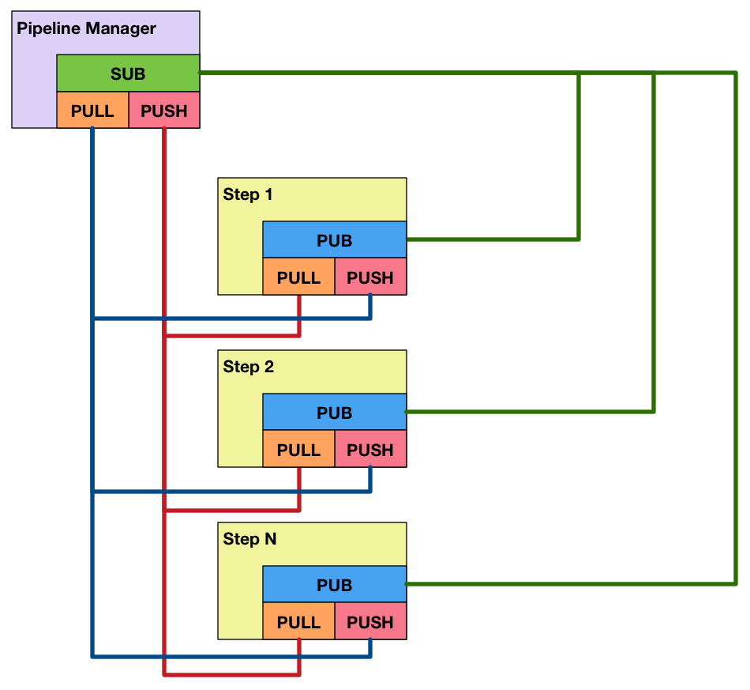

Building a distributed worker pipeline
======================================

Let's build a worker pipeline where ``Steps`` that will execute
specific job types, and can be scaled individually.

Here is an overview of the socket architecture:

Coding the pipeline entity
--------------------------

The main pipeline contains the following sockets:

* a ``SUB`` socket where it will
  :py:meth:`~agentzero.core.SocketManager.bind` at the given
  ``bind_address`` and subscribe to ``Step`` events

* a ``REP`` socket where it will respond to pipeline execution
  :py:meth:`~agentzero.core.SocketManager.bind` at the given
  ``reply_address`` and reply with a job id for later status querying

* a ``REP`` socket where it will respond to pipeline execution
  :py:meth:`~agentzero.core.SocketManager.bind` at the given
  ``reply_address``

.. literalinclude:: guide01-pipeline.py
   :language: python
   :emphasize-lines: 11-13
   :linenos:
   :encoding: utf-8

Coding the step entity
----------------------

A ``Step`` contains a PUB socket where it will send the following events:

* announce its ``JobType`` as well as its PUSH/PULL ``address`` pair
* announce failed jobs, so that they can be auto-recovered later
* announce succeeded jobs
* announce exceptions and auto-schedule a later retry
* live metrics
* live logging output
